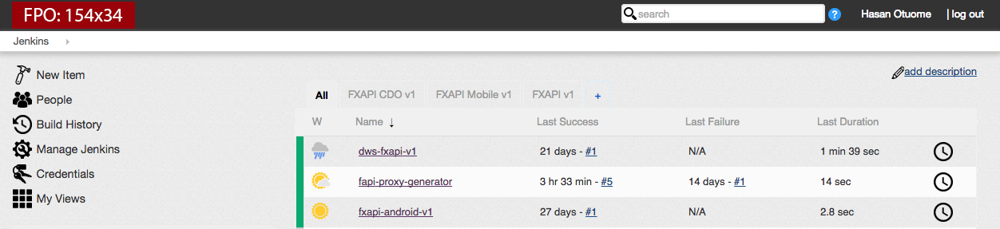

# Jenkins Atheneum Theme Based on Rackspace Canon(tm) Theme

CSS and JS to implement an alternate version of [Rackspace Canon](http://canon.rackspace.com/) as a theme for [Jenkins CI](http://jenkins-ci.org/).

Compatible with Jenkins UI post-1.572.

Last tested with 1.608.

### Before


### After



## Hosted Files

CSS: https://otuome.github.io/themes/jenkins/atheneum-jenkins/min/style.css

JS: https://otuome.github.io/themes/jenkins/atheneum-jenkins/min/app.js

**Note:** This project assumes that you have access to your Jenkins installation and can upload your theme files into the
`$JENKINS_HOME/userContent` directory.

## Usage

1. Install the [Simple Theme Plugin for Jenkins](https://wiki.jenkins-ci.org/display/JENKINS/Simple+Theme+Plugin)
2. Install the [jQuery Plugin for Jenkins](https://wiki.jenkins-ci.org/display/JENKINS/jQuery+Plugin)
3. Navigate to Jenkins > Manage Jenkins > Configure System > Theme
4. Set _URL of theme CSS_ to `/userContent/themes/jenkins/atheneum-jenkins/min/styles.css`
5. Set _URL of theme JS_ to `/userContent/themes/jenkins/atheneum-jenkins/min/app.js`

**Note:** If you're using a Bitnami Jenkins image, prepend `/jenkins` to the above CSS + JS URLs.

## Building

```
npm install
grunt
```

## To manually change SimpleTheme CSS and JS values

1. Edit: `$JENKINS_HOME/org.codefirst.SimpleThemeDecorator.xml` with code below
2. Restart Jenkins

```
<?xml version='1.0' encoding='UTF-8'?>
<org.codefirst.SimpleThemeDecorator plugin="simple-theme-plugin@0.3">
  <cssUrl>/jenkins/userContent/themes/jenkins/atheneum-jenkins/min/styles.css</cssUrl>
  <jsUrl>/jenkins/userContent/themes/jenkins/atheneum-jenkins/min/app.js</jsUrl>
</org.codefirst.SimpleThemeDecorator>
```

## Customizing the Logo
1. Create a logo using your favorite graphics editor (_dimensions: 154x34_)
2. Name the file `dashboard-logo.png`
3. Upload the file to `$JENKINS_HOME/userContent/themes/jenkins/atheneum-jenkins/min`
4. Reload your Jenkins dashboard

## Customizing the Icons

1. Clone the [Atheneum Theme](https://github.com/otuome/otuome.github.io) repository
2. Update the icons to your liking
3. Upload the updated icons folder to `$JENKINS_HOME/userContent/themes/jenkins/atheneum-jenkins`
4. Reload your Jenkins dashboard
